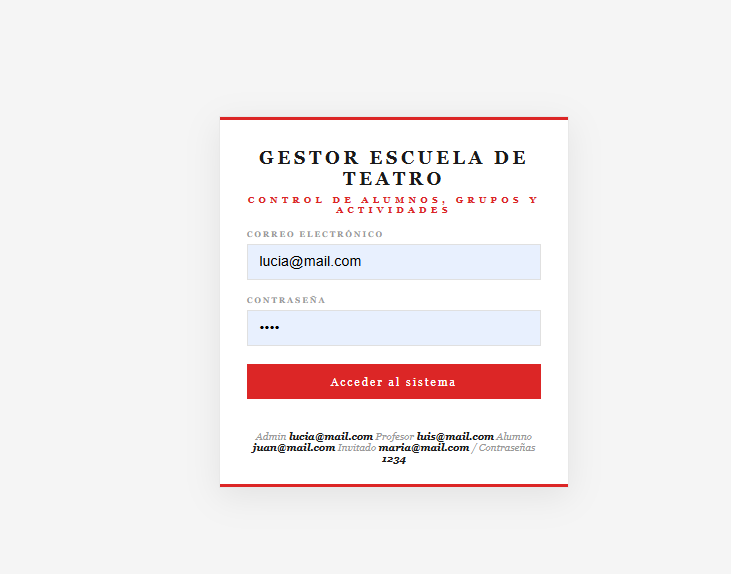
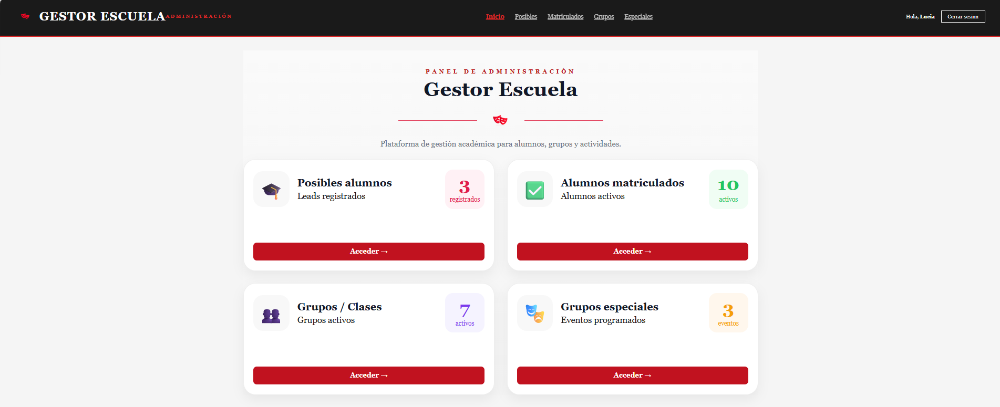
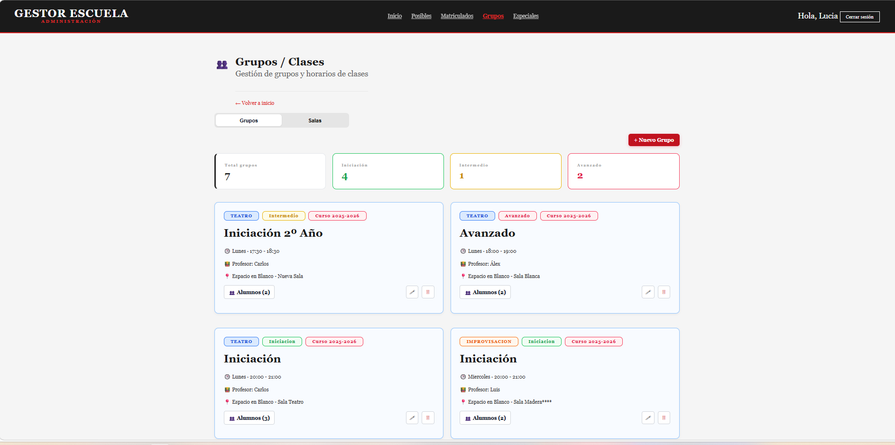
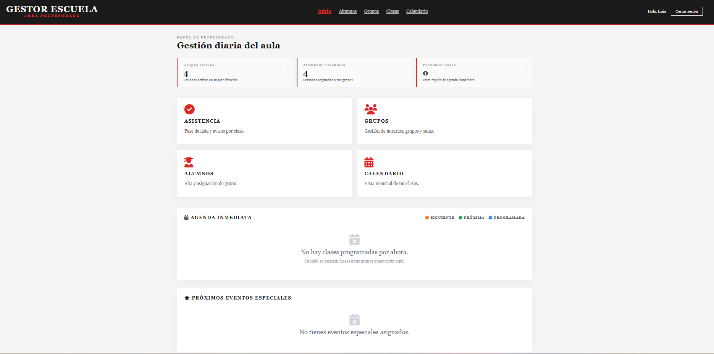
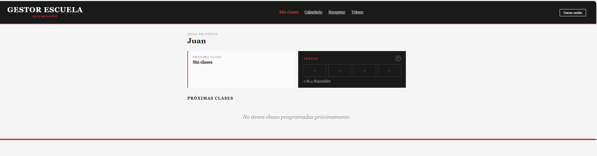
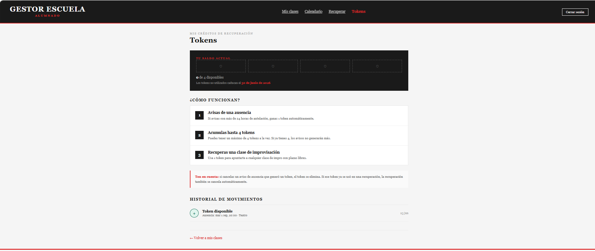

# Gestor Escuela de Teatro

Aplicación web para gestionar la actividad académica de una escuela de teatro mediante accesos diferenciados para **administración, profesorado y alumnado**.

El sistema centraliza la gestión de alumnos, matrículas, grupos, salas, clases, asistencia, eventos especiales y recuperación de clases mediante tokens.

> Este repositorio contiene una versión personal de un proyecto desarrollado inicialmente en equipo durante la formación de Desarrollo de Aplicaciones Web. Mi trabajo se centró principalmente en el área de administración y, posteriormente, incorporé mejoras en las funcionalidades y vistas de los tres roles.

## Funcionalidades principales

### Administración

- Gestión de posibles alumnos y alumnos matriculados.
- Creación, edición y eliminación de grupos.
- Asignación de profesores, salas, niveles y horarios.
- Gestión de matrículas.
- Organización de eventos y grupos especiales.
- Panel resumen con los principales datos de la escuela.

### Profesorado

- Consulta del alumnado asignado.
- Gestión de grupos, clases y horarios.
- Registro y seguimiento de asistencia.
- Consulta del calendario y de la agenda de clases.

### Alumnado

- Consulta de próximas clases y calendario mensual.
- Comunicación anticipada de ausencias.
- Obtención de tokens por ausencias avisadas con al menos 24 horas de antelación.
- Acumulación de hasta cuatro tokens.
- Solicitud de recuperación de clases de improvisación con plazas disponibles.
- Consulta del saldo y del historial de movimientos.

## Tecnologías

- PHP
- MySQL y SQL
- HTML5
- CSS3
- JavaScript
- Programación orientada a objetos
- Git y GitHub

La aplicación utiliza `mysqli`, enrutado manual y una organización separada en controladores, modelos y vistas. No utiliza frameworks ni Composer.

## Capturas de pantalla

### Acceso al sistema

Inicio de sesión con redirección al área correspondiente según el tipo de usuario.



### Panel de administración

Resumen de posibles alumnos, matrículas activas, grupos y eventos.



### Gestión de grupos

Vista para consultar, crear, editar y eliminar grupos, con información sobre nivel, horario, profesor, sala y alumnado asignado.



### Panel del profesorado

Acceso a alumnado, grupos, clases, asistencia, calendario y agenda.



### Panel del alumnado

Consulta de próximas clases, calendario, recuperaciones y tokens.



### Sistema de tokens

Explicación del proceso de obtención y uso de tokens, saldo disponible e historial de movimientos. Los datos mostrados pertenecen al curso 2025–2026, cuyos tokens caducan al finalizar el curso.



## Estructura del proyecto

```text
Gestor-Escuela-de-Teatro/
├── app/
│   ├── controllers/
│   ├── models/
│   └── views/
├── config/
│   └── database.php
├── database/
├── public/
│   ├── css/
│   └── js/
├── routes/
│   └── web.php
├── sql/
├── index.php
└── setup.php
```

## Instalación local

### Requisitos

- XAMPP o un entorno equivalente con Apache, PHP y MySQL.
- Extensión `mysqli` habilitada.

### Pasos

1. Clona el repositorio o descarga sus archivos dentro de la carpeta `htdocs`:

   ```bash
   git clone https://github.com/LucyTrave/Gestor-Escuela-de-Teatro.git
   ```

2. Inicia Apache y MySQL.

3. Abre `setup.php` en el navegador para crear la base de datos, las tablas y los datos iniciales:

   ```text
   http://localhost/Gestor-Escuela-de-Teatro/setup.php
   ```

   Si Apache utiliza otro puerto, inclúyelo en la dirección. Por ejemplo:

   ```text
   http://localhost:8080/Gestor-Escuela-de-Teatro/setup.php
   ```

4. Accede a la aplicación:

   ```text
   http://localhost/Gestor-Escuela-de-Teatro/
   ```

5. Si el proyecto se guarda con otro nombre de carpeta, sustituye `Gestor-Escuela-de-Teatro` por ese nombre en la dirección.

## Configuración de la base de datos

La conexión se encuentra en `config/database.php`. La configuración local predeterminada utiliza:

- Servidor: `localhost`
- Usuario: `root`
- Contraseña: vacía
- Base de datos: `punto_de_partida`

Si tu entorno utiliza otros datos de acceso, modifícalos antes de ejecutar la instalación.

## Usuarios de demostración

Después de ejecutar `setup.php`, se pueden utilizar los siguientes accesos:

| Acceso | Correo | Contraseña |
| --- | --- | --- |
| Administración | `lucia@mail.com` | `1234` |
| Profesorado | `luis@mail.com` | `1234` |
| Alumnado | `juan@mail.com` | `1234` |
| Invitado | `maria@mail.com` | `1234` |

Estas credenciales son exclusivamente datos de demostración para ejecución local.

## Lógica de negocio destacada

- Autenticación y redirección según el rol.
- Relación entre alumnos, grupos, profesores, salas y clases.
- Registro de asistencia.
- Generación de tokens al avisar una ausencia con la antelación establecida.
- Control de un máximo de cuatro tokens disponibles.
- Recuperación de clases utilizando tokens.
- Cancelación relacionada entre avisos, tokens y recuperaciones.
- Gestión de eventos especiales e inscripciones.

## Estado del proyecto

Proyecto funcional en entorno local y en mejora continua. No dispone de una demostración pública porque necesita un servidor con PHP y MySQL; el funcionamiento puede revisarse mediante el código, las instrucciones de instalación y las capturas incluidas.

## Documentación

- [Manual de usuario](Manual_usuario_Gestor_Escuela_Teatro.pdf)
- [Documentación técnica](Documentacion_tecnica_Gestor_Escuela_Teatro.pdf)

Ambos documentos proceden del trabajo realizado en equipo y han sido revisados para esta versión personal de portfolio.


## Autora

**Lucía Jiménez Travé**  
Desarrolladora Web Junior  
[Perfil de GitHub](https://github.com/LucyTrave)
